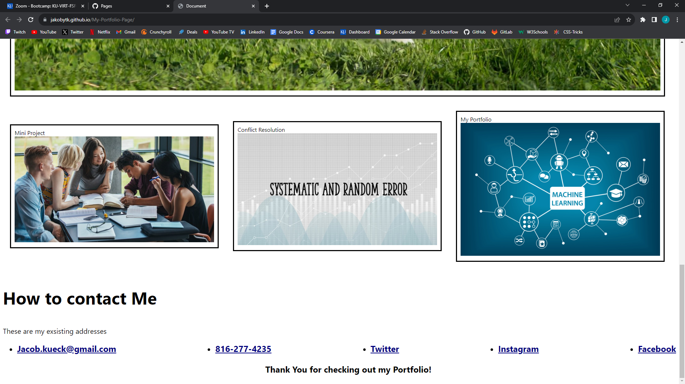
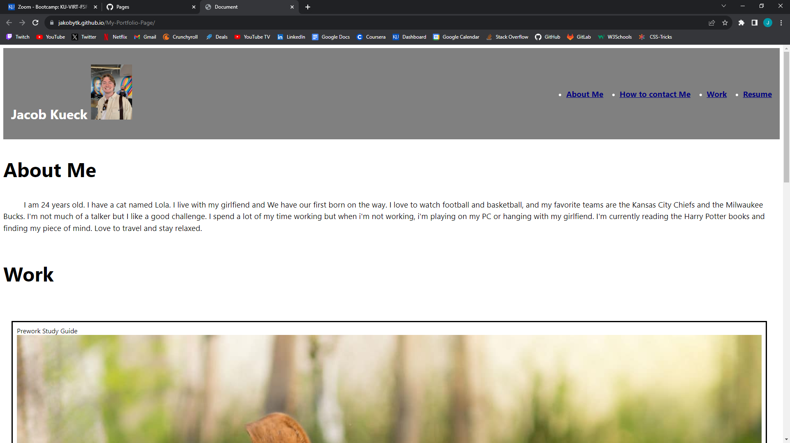

# My-Portfolio-Page

## Description
 
 - I wanted to have a working base of a portfolio to be able to build off of and use to better myself.
 - The use of this webpage is to have a nice portfolio for Employers to look at during the application process.
 - There is a CSS sheet and a HTML sheet I have worked on and built up to the best of my knowlegde so far, and I wish to continue to learn and grow.
 - Criteria has been met to the best of my abilities.

 ## Link 

 https://jakobytk.github.io/My-Portfolio-Page/

 ## Screenshots

 
 